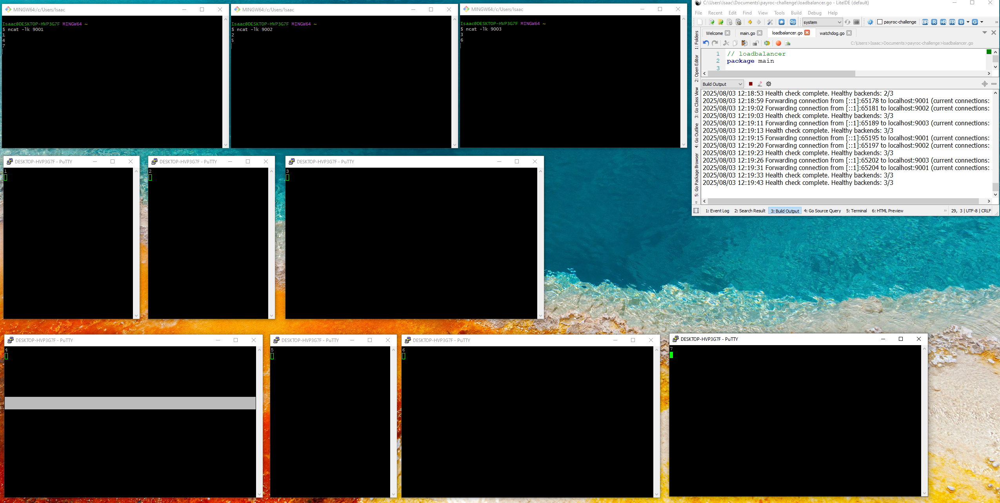

# Payroc Load Balancer Challenge

A software-based Layer 4 (TCP) load balancer built in Go. This project demonstrates concurrent connection handling, asynchronous health monitoring, and simple dynamic load distribution.

## Versions

- Go: 1.21.13

## What it does

Features
- Listens for incoming TCP connections on a configurable port.
- Asynchronously Monitors Health: A background "watchdog" goroutine periodically checks the health of all backend servers.
- Dynamic Load Balancing: Uses a least connections algorithm to forward traffic, ensuring that new connections are sent to the backend server with the lowest current load.
- Automatic Failover: Unresponsive backends are automatically and temporarily removed from the rotation. They are seamlessly re-added once they become healthy again, with no downtime for the load balancer.
- High Concurrency: Handles multiple clients simultaneously using goroutines for non-blocking I/O.

## How to run it
### 1. Start the Load Balancer
In your project directory, run:

```bash
go run .
```
You will see log output confirming the load balancer and the health checker have started.

2. Simulate Backend Services
Open three separate terminal windows and run one command in each to act as your backend servers:

```bash
# Terminal 1
ncat -lk 9001

# Terminal 2
ncat -lk 9002

# Terminal 3
ncat -lk 9003
```

3. Connect a Client
Use a TCP client like PuTTY.

```putty
Host Name (or IP address): localhost
Port: 8080
Connection type: Raw
```

## Demo Screenshot

Here's the project running with 3 fake backends and multiple client sessions:


